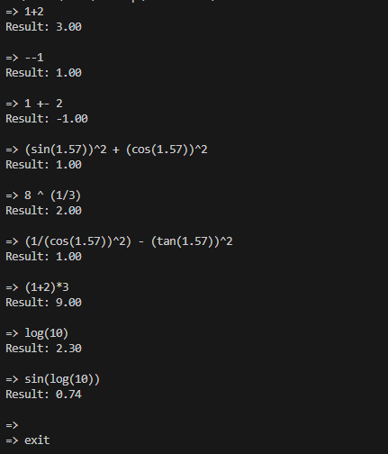

# Calc

To run use the calculator.exe file.

straight away start off with your expression!  

type "exit" to exit the program.

Features:
1) can handle complex expressions involving multiple parentheses.
2) supports * / + - % ^
3) supports sin,cos,tan and log. (use sin('in radians'), log(#base e#))

Examples:

